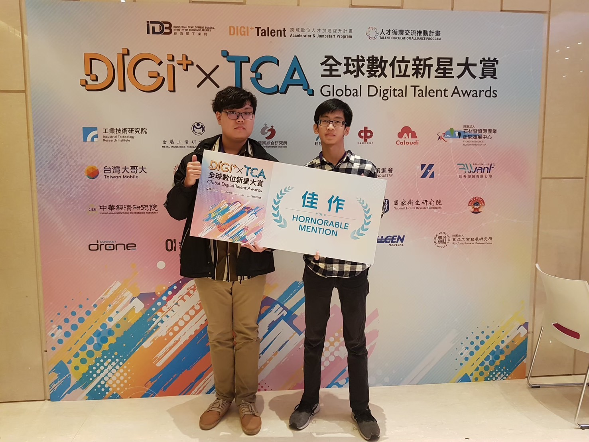

<!-- ========================= -->
<!--     GitHub Portfolio      -->
<!-- ========================= -->

<div align="center">

# 👨‍💻 楊昕倫｜貓心輪塚（TimMovE）
**Software Engineer / Full-Stack Developer / System Designer**  
Focus: **Web System, ERP/OMS/Dispatch, Database Design, IoT Integration**

<p>
  <a href="https://github.com/Kinji125521">
    
  </a>
  &nbsp
  <a href="mailto:alex3695147@gmail.com">
    
  </a>
  &nbsp
  <a href="https://www.linkedin.com/in/昕倫-楊-0b066430a">
    
  </a>
  &nbsp
  <!-- <a href="https://your-portfolio-site.com">
    
  </a> -->
</p>



</div>

---

## 👋 About Me
我是一位具備 **全端系統開發能力** 的軟體工程師，熟悉從需求分析、系統設計、資料庫規劃到 API 與前端介面整合的流程。  
擅長開發企業內部管理系統（EIP / HR / CRM / OMS / Dispatch），並著重於：

- ✅ **資料庫設計（ERD / 正規化 / FK / Index / Concurrency）**
- ✅ **ASP.NET Core Web API + EF Core**
- ✅ **React + Vite 前端開發**
- ✅ **Git 團隊協作流程 / Repo 規範**
- ✅ **IoT / Raspberry Pi / 嵌入式串接**

---

## 🧰 Tech Stack
- **Frontend**：React / Vite / JavaScript / Bootstrap / antd
- **Backend**：ASP.NET Core Web API / EF Core / Swagger
- **Database**：SQL Server / Index / Trigger / Stored Procedure
- **Tools**：Git / GitHub / Postman / SSMS / Visual Studio / VS Code
- **Languages**：C# / Java / Python / C++ / SQL

---

## 📌 Table of Contents
- [🏆 Highlight Projects](#-highlight-projects)
- [📦 All Projects](#-all-projects)
- [🧪 Mini Works / Practice](#-mini-works--practice)
- [📄 Resume](#-resume)
- [📬 Contact](#-contact)

---

# 🏆 Highlight Projects
> ⭐ 建議：把最強的 2~4 個作品放這裡（面試官只看這區就夠）

---

## ⭐ TimMovE｜搬家公司管理平台（EIP × OMS × Dispatch × HR）


**一句話**：整合案件管理、派工調度、排班人力與車輛資源的搬家公司營運平台。  
**角色**：五人團隊｜負責調度與排程模組（Vehicle & Scheduling）

**Key Features**
- 案件建立即產生任務（Case → Task → TaskSchedule）
- 車輛 / 人員排班派工（Day / Night / All-day）
- 工作紀錄、打卡、附件與照片管理（Photo / Attachment）
- 多表整合（47+ tables）、高關聯 ERD 設計

**Tech**
`React` `Vite` `react-router-dom` `axios`  
`ASP.NET Core Web API` `EF Core` `Swagger`  
`SQL Server` `FK` `Index`

**Links**
- 🌐 Demo：https://your-demo-link.com
- 📄 API Swagger：https://your-api-link.com/swagger
- 🧠 ERD 圖：./database/ERD.png
- 💻 Repo：https://github.com/yourname/timmove

<details>
<summary><b>📌 Read More（設計細節 / 架構說明）</b></summary>

### System Architecture
```text
React(Vite) → Axios → Web API → EF Core → SQL Server
