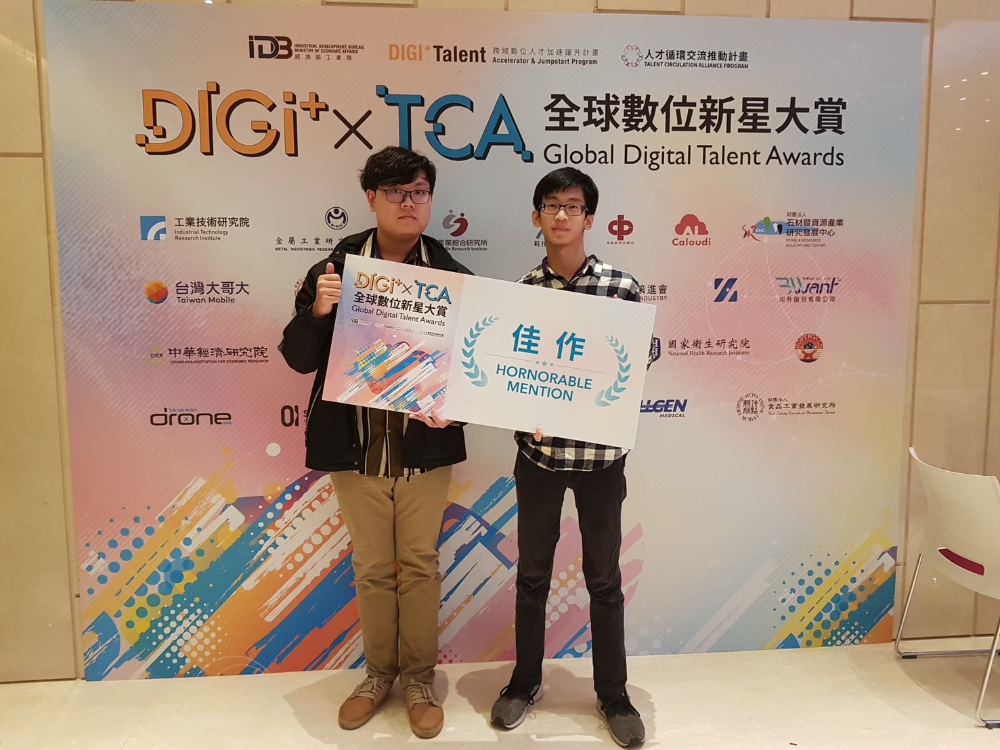
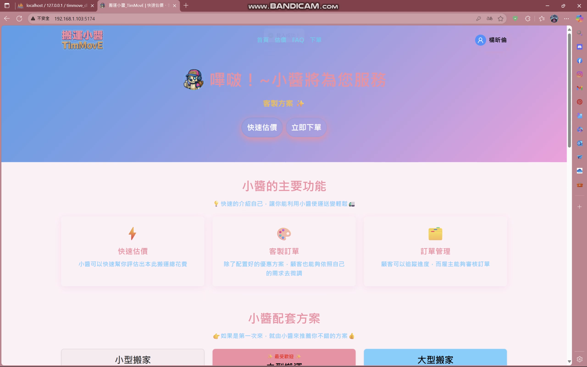
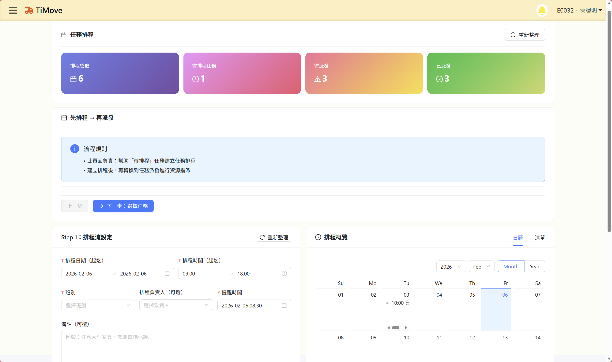

<!-- ========================= -->
<!--     GitHub Portfolio      -->
<!-- ========================= -->

<div align="center">

# 👨‍💻 楊昕倫作品集
**Software Engineer / Full-Stack Developer / System Designer**  
Focus: **Web System, Database Design, IoT Integration**

<p>
  <a href="https://github.com/Kinji125521">
    
  </a>
  &nbsp
  <a href="mailto:alex3695147@gmail.com">
    
  </a>
  &nbsp
  <a href="https://www.linkedin.com/in/昕倫-楊-0b066430a">
    
  </a>
  &nbsp
  <!-- <a href="https://your-portfolio-site.com">
    
  </a> -->
</p>



</div>

---

## 👋 About Me
我是一位具備 **全端系統開發能力** 的軟體工程師，熟悉從需求分析、系統設計、資料庫規劃到 API 與前端介面整合的流程。  
擅長於開發大型整合專案且著重使用以下技術：

- ✅ **資料庫設計（ERD / 正規化 / FK / Index / Stored Procedure）**
- ✅ **後端開發 ASP.NET Core Web API｜EF Core｜Node.js**
- ✅ **前端開發 React + Vite**
- ✅ **團隊協作流程 Git / Repo 規範**
- ✅ **嵌入式串接 IoT / Raspberry Pi**

---

## 🧰 Tech Stack
- **Frontend**：React / Vite / HTML5 / CSS / JavaScript / jQuery / Bootstrap / antd
- **Backend**：ASP.NET Core Web API / ASP.NET Core MVC / EF Core / Node.js / Express
- **Database**：SQL Server / MySQL / SQLite / MongoDB
- **Tools**：Visual Studio / VS Code / Git / GitHub / Postman / SSMS / DBeaver / Node-RED / Anaconda / Android Studio
- **Languages**：C# / Java / Python / C++ / SQL
- **Embedded**：Arduino / Raspberry Pi

---
## ⭐ 搬運小醬_TimMovE-搬家公司網站開發


**簡介**：將公司相關的介紹與服務資訊提供給自家的客戶，並且讓客戶進行快速的線上估價與訂單建立，同時用戶也能對訂單做審核與管理。  
**角色**：個人獨力開發完整前後端。

**開發工具庫與環境**
- 工具 VS Code + XAMPP
- 前端 React + Vite 框架
- 後端 Node.js 框架 + Express架構
- 版本 GitHub
- 資料庫 MySQL

**開發程式語言與套件**

- 語言： HTML5, CSS, Javascript, SQL
- 套件：Bootstrap5, Ant Design


**Links**
- 🌐 Info：https://docs.google.com/presentation/d/1DdXtn302oA1h3GxBD5-OvI0f4LBHQcu6/edit?usp=sharing&ouid=112700791309797889256&rtpof=true&sd=true
- 💻 Repo：https://github.com/Kinji125521/TimMovE


## ⭐ TimMovE｜搬家公司管理平台


**簡介**：一個全方位的搬運公司管理平台，涵蓋人事、業務、行政、外勤、客服等多個模組，旨在提升搬運公司的運營效率。  
**角色**：五人團隊｜負責團隊開發方向與進度的組長，也同時是負責系統的任務排程模組、資料庫與系統整合的組員。

**開發工具庫與環境**
- 工具 VS Code + Visual Studio 2022 + SSMS + DBeaver
- 前端 React + Vite 框架
- 後端 ASP.NET Core Web API + ADO.NET Entity Framework
- 版本 GitHub
- 資料庫 Microsoft SQL Sever 資料庫

**開發程式語言與套件**

- 語言： HTML5, CSS, Javascript, C#, LINQ, SQL
- 套件：Bootstrap5, Ant Design, OpenStreetMap

**Tech**
`React` `Vite` `react-router-dom` `axios`
`HTML5` `CSS` `JavaScript` `C#`
`ASP.NET Core Web API` `EF Core` `Swagger`  
`SQL Server`

**Links**
- 🌐 Info：https://docs.google.com/presentation/d/1Spb1mKy1w-poQkI-iGw-WZmC69mF6pYuNBLPjdg24Sw/edit?usp=sharing
- 🧠 ERD 圖：https://drive.google.com/file/d/1PNRlDhJQhEeCi29j1BCZGhrZCrvGWAE3/view?usp=drive_link
- 💻 Repo：
- 前端：https://github.com/Kinji125521/TimMovE_Frontend
- 後端：https://github.com/Kinji125521/TimMovE_WebAPI_Backend

<!-- <details>
<summary><b>📌 Read More（設計細節 / 架構說明）</b></summary>

### System Architecture
```text
React(Vite) → Axios → Web API → EF Core → SQL Server -->
